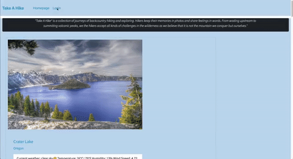
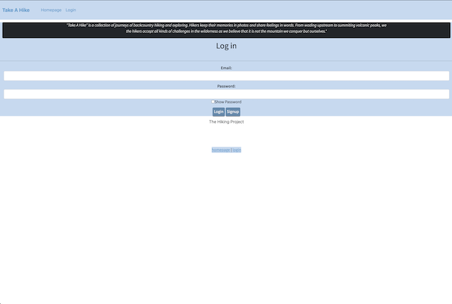
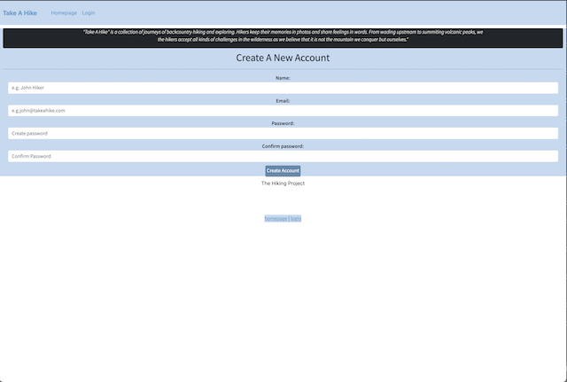
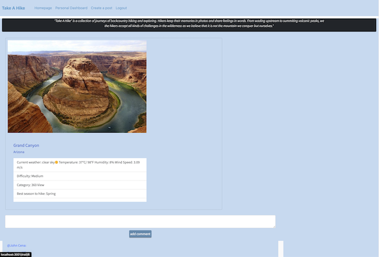
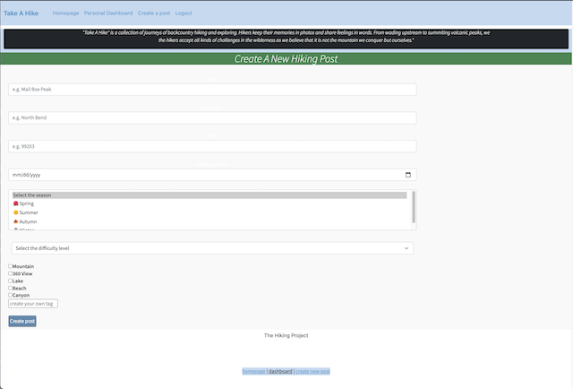
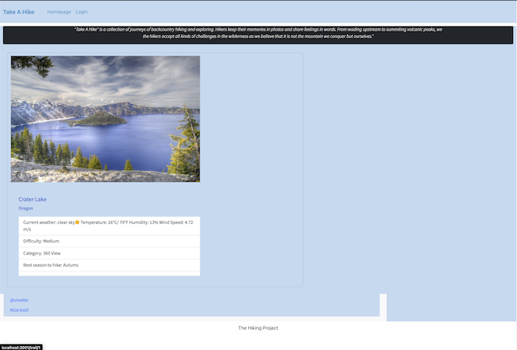

# Take A Hike

Take a Hike is an application that hikers can use create post of hikes they have taken and hikes they want to take in the future. Users will also be able to see other users hikes and comment on them.
## Table of Contents

- [About the Project](#about-the-project)
- [Installation](#installation)
- [Usage](#usage)
- [Credit](#credit)
- [License](#license)

## About the Project

The motivation for this project is to support hikers and to create a community of hikers sharing all their hikes and reviews/comments for future hikers. 
Built with the following technologies 
  - Bootrap
  - MySQL (Workbench)
  - MySQL2
  - Insomnia
  - Handlebars
  - Express
  - Sequelize
  - Handlebars Helpers
  - Nodemon
  - [Live Heroku Page](https://lit-tor-33671.herokuapp.com/)
  
## Installation

  - [Open Take A Hike](https://github.com/vinetteg/TakeAHike_TeamProject2)
  - User will need to install Node JS by clicking the following link https://nodejs.org/en/download/
  - Install all the npm packages.
    ```
    npm i express mysql mysql2 nodemon handlebars path express-session connect-session-sequelize dotenv bcrypt
    ```
## Usage

Once a user has created a profile they will be able to post hikes they have done and hikes they wish to do in the future. The hike post will show current weather, best season to hike, difficulty, and add tags. Users will also be able to see other users post and make comments on those posts.

## Credit

- Chris Abiva - https://github.com/Chabivz
- Vinnette Gutierrez - https://github.com/vinetteg
- Matt Koski - https://github.com/mjkekai
- Rex Yu - https://github.com/yu19910513
## Links

- Heroku - https://lit-tor-33671.herokuapp.com
- Github - https://github.com/vinetteg/TakeAHike_TeamProject2
## Media

Wireframe \
\

Take A Hike Demo \
\
Take A Hike Login\
\
Take A Hike Signup\
\
Take A Hike Dashboard\
\
Take A Hike Create New Hike\
\
Take A Hike Add Comment/Review \
 


## License

The MIT License (MIT)

Copyright (c) 2015 Chris Kibble

Permission is hereby granted, free of charge, to any person obtaining a copy of this software and associated documentation files (the "Software"), to deal in the Software without restriction, including without limitation the rights to use, copy, modify, merge, publish, distribute, sublicense, and/or sell copies of the Software, and to permit persons to whom the Software is furnished to do so, subject to the following conditions:

The above copyright notice and this permission notice shall be included in all copies or substantial portions of the Software.

THE SOFTWARE IS PROVIDED "AS IS", WITHOUT WARRANTY OF ANY KIND, EXPRESS OR IMPLIED, INCLUDING BUT NOT LIMITED TO THE WARRANTIES OF MERCHANTABILITY, FITNESS FOR A PARTICULAR PURPOSE AND NONINFRINGEMENT. IN NO EVENT SHALL THE AUTHORS OR COPYRIGHT HOLDERS BE LIABLE FOR ANY CLAIM, DAMAGES OR OTHER LIABILITY, WHETHER IN AN ACTION OF CONTRACT, TORT OR OTHERWISE, ARISING FROM, OUT OF OR IN CONNECTION WITH THE SOFTWARE OR THE USE OR OTHER DEALINGS IN THE SOFTWARE.